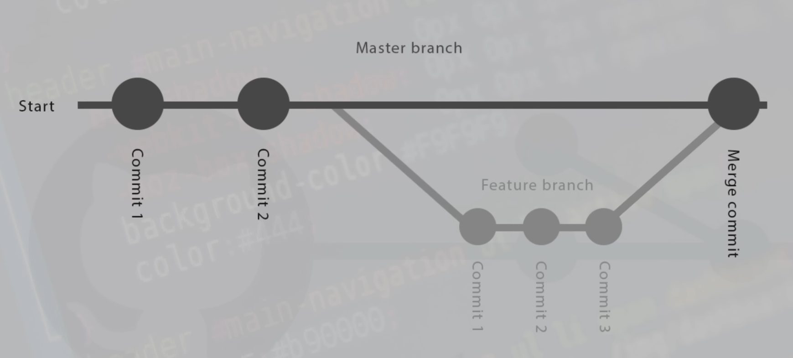

<h1>Git Self Tutorial</h1>

<h6>PREAMBLE
This is made only for myself to study Git and Markdown, so do not use it as a guide, as it was created by someone with no experience in Git.<h6>

### Starting Git

***

- **mkdir** *foldername* <pre>create a git directory (folder) named _foldername_ </pre>
after this, you shoud `cd` to this directory - this is where the .git folder (hidden by default) <ins>will</ins> be placed

***

- **git init** <pre>Initialize a Git repository in the current path </pre>
This also creates a hidden .git directory. Use `ls -a` to view all files

***

- **git config --global user.name "Your Name"** 
- **git config --global user.email your@email.com**<pre>Set your global Git username and email</pre> use `git config user.name` and `git config user.email` to get info about name and email

***

### Workflow and Snapshots

***

- **git add file.extension** <pre>Add a file to the staging area before committing</pre>
`git add .` will add all files in the repository 

Deleting files: after deleting files in the repo we must use `add` _`deleted_file`_ and this file we be removed from a staging area (refresh status)

***

- **git status** <pre>after any file modifications we can check the status of the repo and track files </pre>
Note that after modifying files, you must run `git add` _`modified_file`_ to refresh the status!  
`git log` get a log about all commits. Use `"q"` to exit log   
`git diff` get a information about changes e.g new code lines.  Use `"q"` to exit log

***

- **git commit -m "message"** <pre>commit to permanently store the snapshot in the repo </pre>
`git commit -am` for adding all modified/deleted tracked files and commit them with this message

***

### Pushing Code to GitHub

***

after `git add` and `git commit` we can push (upload) the code to a remote repository on GitHub (first create one in GitHub)

- **git remote add origin *repo-url*** <pre>This command links your local Git repository to a remote repository e.g. on GitHub </pre>
`git remote remove origin` Unlinks the remote repository

***

- **git push origin master** or **git push origin main**<pre>pushes files to the GitHub repo</pre>

***

### Other Modifications on Files

***

- **git rm _filename_** <pre>removes file from your local directory</pre>
`git rm -rf` _`foldername`_ removes a folder from your local directory   `-r` recursive (allows to remove folders and their contents)   `-f` force (ignore warnings, remove even if changes are staged or not committed)

***

- **git mv** _**old_filename**_ _**new_filename**_ <pre>rename file</pre>

***

### Cloning and Pulling

***

- **git clone *url-addres*** <pre>clone entire repository from GitHub using for example a _https_ link to the project on your local machine</pre>
`git clone` _`url-addres`_ _`foldername`_ cloning + naming a folder with _foldername_ you've set on your local machine

***

- **git pull** <pre>if somebody made changes in the GitHub repo you can _pull_ these changed/new files to your local machine</pre>
inclusive commit messages, just use `git log` to review them

***

### Deleting commits 

***

0. (optional) `git checkout` _`branchname`_ (e.g main, master etc.)
1.  `git reset --hard HEAD~n` deletes the last `n` commits, without UNDO!   

&emsp; -use `git reset --soft HEAD~n` removes the commit but keeps your changes in the staging area 
&emsp; -use `git reset --mixed HEAD~n` removes the commit and unstages the changes

2. delete your repository from GitHub using `Settings` Tab while viewing repository  

&emsp; &emsp; 

***

### Merging and Branching

***

**<h4>Quick Overview</h4>**

&emsp; &emsp;   

&emsp; [Foto Source](https://www.youtube.com/watch?v=XX-Kct0PfFc&list=WL&index=5 "shish")

***

- **git branch _branchname_** <pre>creates new branch on GitHub </pre>
`git branch` list all branches availible

***

- **git checkout _branchname_** <pre>enter the desired branch </pre>
you can modify anything without changes on the _main(master)_ branch  
`git push origin _branchname_` to store the changes on a separate branch(in my case _**git push origin TestBranch**_)

***

- **git merge _mergingBranch_** <pre>adds content from _mergingBranch_ into the present Branch </pre>
if we want to add for example the new content from _TestBranch_ to _master_ we need to use `checkout master`  
then we just use `git merge TestBranch` to merge them. **TestBranch -> master**

***

<h3>Merging Conflicts</h3>

***
Imagine the following scenario:  
You are working on a separate **_branch b_**, and there is a **_main branch a_**. Then somebody edits `styles.css` and inserts something into the body selector, for example: `margin: 20px;`. 
Meanwhile, you are also editing the `styles.css` file in your branch and add `padding: 30px;`.
After that, you checkout the **_main branch a_** and **_merge_** your **_branch b_** into it.
A <ins>conflict</ins> occurs because you are editing the same file - in this case, the same selector (body selector).

***

<h4>How to prevent conflicts</h4>

- everybody needs to know what he/she is doing(who is **responsible** fow what)
- editing the main or master is a bad idea in the big repository with many people, insted your should **fork** or use a **separate branch** and then push the changes into the main/master
- communication with other Contributers is **crucial**
- many other aspects, main obstacle is to solve already existing conflicts